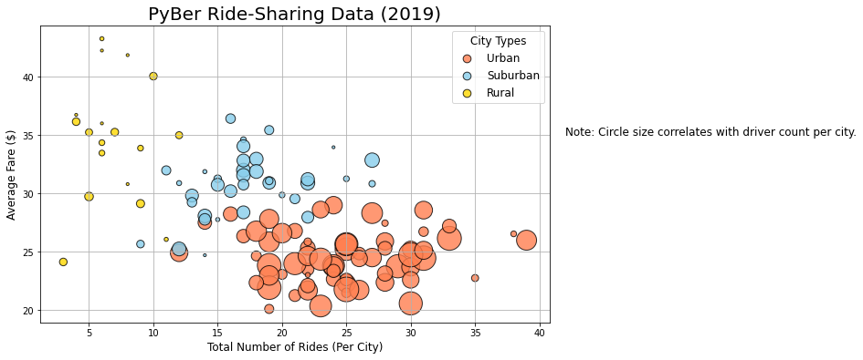
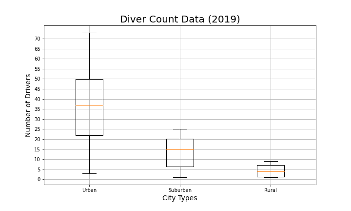

# PyBer_Analysis

## Overview of Analysis 
In this new analysis the goal is to create a summary DataFrame of the ride-sharing data by city type using Python skills and knowledge of Pandas. Next with Pandas and Matplotlib, we'll then create a multiple line graph which displays the total weekly fares for each city type. With this analysis and data we'll be able to summarize how the data differs by city type and how the decision-makers at PyBer can use these data formulated to draw conlusions.

## Results 

### Challenge Summary

### Pyber Ride-Shareing Data (2019)

### Ride Count Data (2019)

### Ride Fare Data (2019)

### Driver Count Data (2019)

### Pie Chart of % of Total Fares by City Type

### Pie Chart of % of Total Rides by City Type

### Pie Chart of % of Total Drivers by City Type

## Summary
