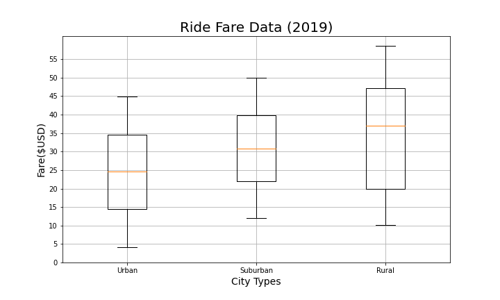

# PyBer_Analysis

## Overview of Analysis 
In this new analysis the purpose is to create a summary DataFrame of the ride-sharing data by city type using Python skills and knowledge of Pandas. Next with Pandas and Matplotlib, we'll then create a multiple line graph which displays the total weekly fares for each city type. With this analysis and data we'll be able to summarize how the data differs by city type and how the decision-makers at PyBer can use these data formulated to draw conlusions. Then we will go on to use different box plots and pie charts to validate the results we got from the multiple line chart. All of this information combined will help us aid the CEO in adressing any disparities among the city types by being able to summarize three buisness recomendations.

## Results 

### Challenge Summary

* #### We can condlude that Urban cities generate the most revenue comopared to Rural and Suburban.

* ####  This chart clearly displays that drivers in Urban cities recieve a larger amount of rides but at a lower average fair where as Rural city drivers recieve less number of rides but the average fair is much higher and suburban city drivers are the middle ground between the two.

* #### This box-plot clearly shows that Urban cities receieve the most amount of rides with Suburban coming in second and Rural being last.

* #### This box-plot clearly shows that Rural cities receieve the most amount of money per ride with Suburban coming in second and Urban being last.

* #### Based on this box plot it clear that Urban cities have the most drivers with suburban being second and rural having the least amount.

* #### This pie chart is another way of show that Urban cities have the highest percentenage of fairs with Suburban being second and Rural last.

* #### This pie chart is another way of show that Urban cities have the highest percentenage of rides with Suburban being second and Rural last.

* #### This pie chart is another way of show that Urban cities have the highest percentenage of drivers with Suburban being second and Rural last.

## Summary

After working with the data and looking at the results in each city type based on multiple factors, we can now draw conclusions from these results that will help benefit the CEO at PyBer. First off we can look at the number of drivers in each city type because without drivers the rest of the buisness cannot run. Looking at the visualizations based on drivers , its clear that Urban City Types have the most drivers with Suburban is second and Rural last. Next taking a look at the number of rides based on City type, its clear that Urban Cities have the most rides per week with Suburban in second and Rural last. Now this is where it gets interesting, when looking at the amount of money made / average fare per ride its clear that Rural cities tend to make the most money per ride with Suburban coming in second and Urban last. Knowing all this information we can draw conlusions that while Urban Cities have the most number of rides and drivers , they do not make the most money per ride. Therefore while it may be very lucrative to move into the Urban cities , it is also very possible to gross revenue in rural and suburban communities due to the fact that the rides in these communities will be much larger rides because destinations in these communities are farther than those in Urban Cities. In conlusion, the CEO at PyBer has clear evidence that each city type has great potential to gross revenue when the buisnesss is executed properly.
